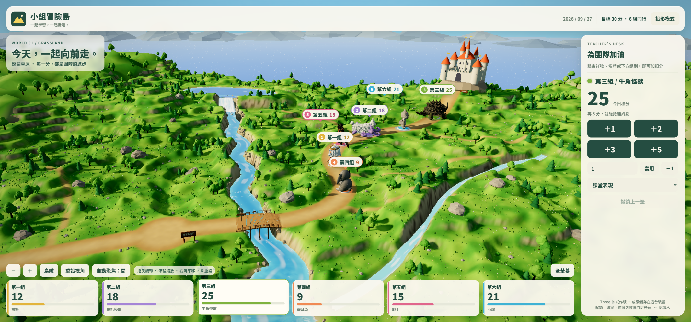

# 小組冒險島 — Three.js 版

以 Three.js + Vite + TypeScript 重做的班級積分遊戲。Godot 版保留在 `../godot`，未更動。



## 執行

需要 Node.js 18 以上。雙擊 `開始遊戲.cmd`，或：

```powershell
cd web_claude_version
npm install
npm run dev        # http://localhost:5188
```

網址參數：

| 參數 | 用途 |
|---|---|
| `?demo=1` | 示範分數（12/18/25/9/15/21），不讀寫真實存檔 |
| `?demo=start` | 六組都在起點，不讀寫真實存檔 |
| `?world=desert` | 本機預覽某個世界（grassland / glacier / desert / skyland / islands） |
| `?emulator=1` | 連到本機 Firebase 模擬器（測試雲端同步用，見下方） |

其他指令：`npm test`（計分邏輯測試）、`npm run build`（輸出到 `dist/`）。

## 功能

- **五個世界**（對照 `04_五種寬闊場景概念圖.png`）：遼闊草原、極地冰河（極光、冰城堡、浮冰）、沙漠峽谷（紅岩台地、石拱門、仙人掌、綠洲）、雲海天空（漂浮島嶼、木橋、雲海、瀑布）、寧靜海島（小島、椰子樹、淺灘、燈塔）。五個世界共用同一條比賽路線，角色行為完全相同。
  - **每日隨機**：依日期決定，每台裝置結果一致，而且不會連續兩天相同。
  - **手動切換**：頂部「世界」選單。雲端模式下，教師切換會同步到所有畫面；未登入的觀看者切換只影響自己的畫面。
- **每日排名**：頂部「每日排名」按鈕，可選日期。今天顯示即時名次，過去日期顯示 **22:00 結算結果**。每天 22:00（台北時間）自動結算、鎖定，00:00 開始新的一天。
- **加扣分**：點吉祥物或名牌會跳出快速加分框；也可以點下方卡片選組，再用右側面板操作（自訂 ±100、撤銷 Ctrl+Z）。得分前進並做慶祝動作，扣分後退並低頭；鏡頭會自動聚焦。
- **鏡頭**：拖曳旋轉、滾輪縮放、右鍵平移、鳥瞰、重設（R）、自動聚焦、全螢幕、投影模式。

## 雲端同步（學校統一登入 hspssso）

已設定為 **412 班**（`src/firebase-config.ts`），資料存在學校 hspssso 專案的 Firestore：`classroomAdventure/class-412/...`。

- **所有人**打開網址都能看到即時分數、公仔走路與當天的世界，不需登入。
- **老師**按畫面右上角「教師登入」，轉到學校統一登入頁；以 **role = admin** 的帳號登入後，才會出現右側加扣分面板。
- 每天 22:00（台北時間）自動結算、鎖定；00:00 新的一天。
- 安全規則在 [firestore.hspssso.rules](firestore.hspssso.rules)，要合併進 `C:\Users\HSPS\Desktop\projects\sso\firestore.rules` 後，在 sso 專案執行 `python firestore_rules_tool.py deploy`。
- 在 localhost 開發時，網頁會連本機的統一登入頁（`http://localhost:3000`，在 `sso\hspssso-portal` 執行 `npm run dev`）；沒開的話自動改用本機模式。
- 網站網域 `https://tyctc128.github.io` 已在統一登入白名單。換網域要用 `register_site.py` 重新登記。

資料結構：

```
classroomAdventure/{classId}                          目標分數、組名
classroomAdventure/{classId}/days/{YYYY-MM-DD}        各組分數、世界、結算時間 closesAt（當天 22:00）
classroomAdventure/{classId}/days/{日期}/events/{序號}  每一筆加分／撤銷
```

要增加其他班級：把 `classId` 改成新的代號。

## 部署到 GitHub Pages

推送到 `main` 分支後，`.github/workflows/pages.yml` 會自動測試、建置並發佈。第一次要到 repo 的 Settings → Pages → Source 選 **GitHub Actions**。

### 用本機模擬器測試（不需要真的專案）

```powershell
npm run emulators          # 另開一個視窗執行，需要 Java
npm run dev
```

開 `http://localhost:5188/?emulator=1`。在模擬器中按「教師登入」會出現假帳號選單；請用 `teacher@example.com` 登入。

## 本機資料

本機模式存在 `localStorage`，格式與 Godot 版 `classroom-v1.json` 相同（version 1），另外記錄每天的世界。

## 素材

- 角色：`../godot/assets/characters/*.glb`。兔子與小貓的 4096 貼圖用 `scripts/optimize_glb.py` 縮成 2048 JPEG（原檔不動）。
- 天空：`../godot/assets/worlds/grassland/azure-sky.png`（草原、沙漠、海島）；冰河與雲海的天空由程式繪製。
- 字型：Google Fonts 的 Noto Sans TC，離線時改用微軟正黑體。

## 結構

```
src/
  main.ts            啟動、事件串接、世界切換
  store.ts           GameStore 介面、本機資料、22:00 結算、每日世界、排名
  cloud-store.ts     Firestore 雲端資料與教師登入
  firebase-config.ts 雲端設定（填入後啟用）
  teams.ts           六組資料與反應參數
  characters.ts      角色載入、移動、反應、隊形
  camera.ts          鏡頭控制與聚焦
  ui.ts              面板、卡片、名牌、快速加分、世界選單、排名視窗、登入
  post.ts            後製（泛光、調色、暗角）
  world/
    index.ts         依 id 建立／拆除世界、燈光與天空
    themes.ts        五個世界的名稱與說明
    palette.ts       草原／冰河／沙漠的配色與地形參數
    layout.ts        道路、河流、湖泊、海岸與高度函數（共用路線）
    terrain.ts       地形網格與著色
    water.ts         湖、河、小溪、瀑布、水霧、海、浮冰
    vegetation.ts    樹、雪松、仙人掌、冰晶、紅岩台地、岩石、野花
    islands.ts       雲海天空與寧靜海島（島嶼、木橋、雲海、燈塔）
    sky.ts           極光／漸層天空、全景天空
    props.ts         城堡、木橋、START/GOAL 看板、遠山
firestore.rules      Firestore 安全規則
tests/store.test.ts
```
